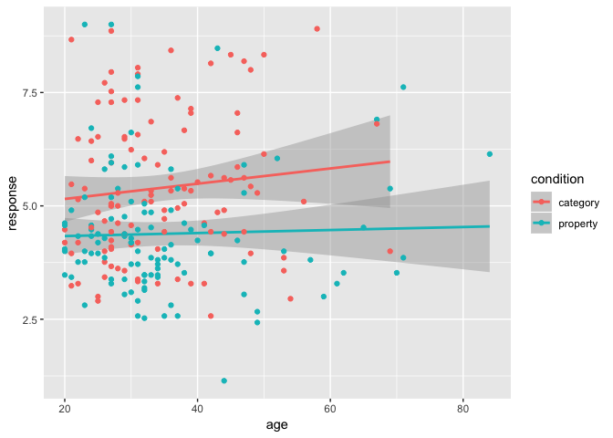
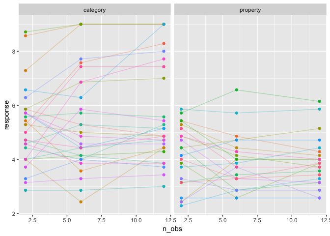
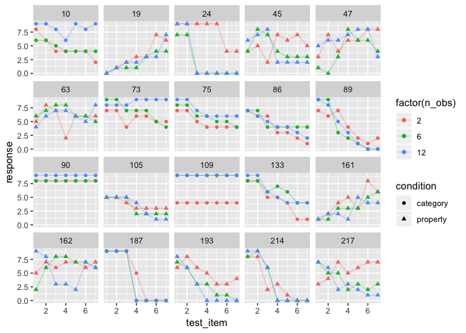
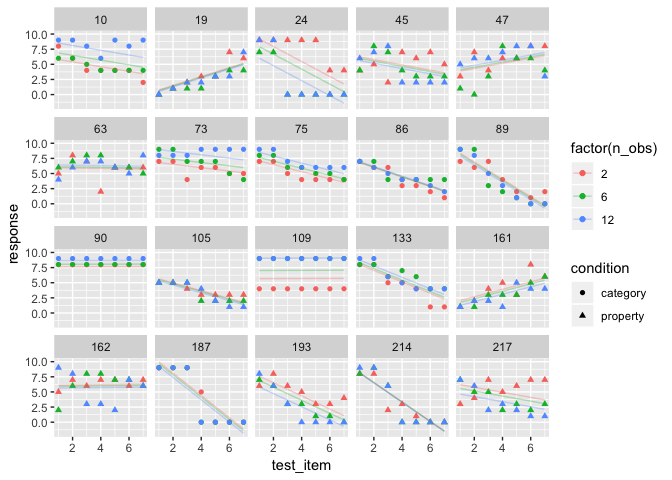
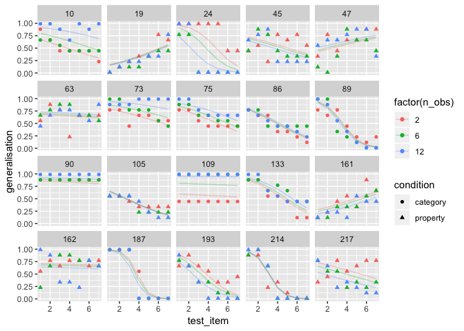

<h1 class="title toc-ignore display-3">
Inferential statistics in R
</h1>
================
Danielle Navarro
5 December 2018

<!--

  html_document:
    includes:
      in_header: header.html
    theme: flatly
    highlight: textmate
    css: mystyle.css

-->
``` r
library(here)
```

    ## here() starts at /Users/dan/GitHub/chdss2018/day2_dataanalysis

``` r
library(tidyverse)
```

    ## ── Attaching packages ───────────────────────────────────────────────────────────────────────────── tidyverse 1.2.1 ──

    ## ✔ ggplot2 3.1.0     ✔ purrr   0.2.5
    ## ✔ tibble  1.4.2     ✔ dplyr   0.7.8
    ## ✔ tidyr   0.8.1     ✔ stringr 1.3.1
    ## ✔ readr   1.1.1     ✔ forcats 0.3.0

    ## ── Conflicts ──────────────────────────────────────────────────────────────────────────────── tidyverse_conflicts() ──
    ## ✖ dplyr::filter() masks stats::filter()
    ## ✖ dplyr::lag()    masks stats::lag()

``` r
frames <- read_csv(here("analysis","data","frames_ex2.csv"))
```

    ## Parsed with column specification:
    ## cols(
    ##   id = col_integer(),
    ##   gender = col_character(),
    ##   age = col_integer(),
    ##   condition = col_character(),
    ##   sample_size = col_character(),
    ##   n_obs = col_integer(),
    ##   test_item = col_integer(),
    ##   response = col_integer()
    ## )

What we aren't going to do!
---------------------------

Base R comes with a lot of classical null hypothesis tests built in. The functions for these are all pretty similar. We're not going to talk about them at all, because they're comparatively easy to learn and it's not the best use of our time! But here are some:

-   t.test
-   chisq.test
-   prop.test
-   binom.test
-   wilcox.test
-   cor.test
-   ks.test

Linear models
-------------

### Relationship between linear models, ANOVA and t-test

Average within subject so there's just one response per person:

``` r
frames_small <- frames %>%
  group_by(id, age, condition) %>%
  summarise(
    response = mean(response)
    ) %>%
  ungroup()
frames_small
```

    ## # A tibble: 225 x 4
    ##       id   age condition response
    ##    <int> <int> <chr>        <dbl>
    ##  1     1    36 category      5.33
    ##  2     2    46 category      7.05
    ##  3     3    33 property      4.86
    ##  4     4    71 property      3.86
    ##  5     5    23 property      9   
    ##  6     6    31 category      7.90
    ##  7     7    23 property      3.76
    ##  8     8    31 property      4   
    ##  9     9    37 category      3.38
    ## 10    10    46 category      5.86
    ## # ... with 215 more rows

Imagining this were our data, we'd typically calculate mean and standard deviation for each condition, across participant. We might also check the number of people in each group:

``` r
frames_small %>%
  group_by(condition) %>%
  summarise(
    mean_resp = mean(response), 
    sd_resp = sd(response),
    n = n()
  )
```

    ## # A tibble: 2 x 4
    ##   condition mean_resp sd_resp     n
    ##   <chr>         <dbl>   <dbl> <int>
    ## 1 category       5.40    1.56   114
    ## 2 property       4.39    1.37   111

Is this a "significant" difference? Traditional solution is the t-test:

``` r
t.test(formula = response ~ condition, data = frames_small, var.equal = TRUE)
```

    ## 
    ##  Two Sample t-test
    ## 
    ## data:  response by condition
    ## t = 5.1625, df = 223, p-value = 5.388e-07
    ## alternative hypothesis: true difference in means is not equal to 0
    ## 95 percent confidence interval:
    ##  0.6259535 1.3988834
    ## sample estimates:
    ## mean in group category mean in group property 
    ##               5.397661               4.385242

Let's try to reframe this a little in term of the actual hypotheses. Normally it'd be H0 and H1, but I'm going to refer to the null hypothesis as model 1 and the alternative as model 2:

``` r
mod1 <- lm(formula = response ~ 1, data = frames_small) 
mod2 <- lm(formula = response ~ condition, data = frames_small)
```

Now:

``` r
anova(mod1, mod2)
```

    ## Analysis of Variance Table
    ## 
    ## Model 1: response ~ 1
    ## Model 2: response ~ condition
    ##   Res.Df    RSS Df Sum of Sq      F    Pr(>F)    
    ## 1    224 539.98                                  
    ## 2    223 482.33  1    57.645 26.652 5.388e-07 ***
    ## ---
    ## Signif. codes:  0 '***' 0.001 '**' 0.01 '*' 0.05 '.' 0.1 ' ' 1

-   notice the *p*-values are the same
-   the test statistics are related: $t = \\sqrt{F}$
-   the residual df in the ANOVA table is the same as the t-test df

Note that this is a slightly different ANOVA table than what you might be expecting to see. A more traditional version looks like this:

``` r
anova(lm(response ~ condition, frames_small))
```

    ## Analysis of Variance Table
    ## 
    ## Response: response
    ##            Df Sum Sq Mean Sq F value    Pr(>F)    
    ## condition   1  57.65  57.645  26.652 5.388e-07 ***
    ## Residuals 223 482.33   2.163                      
    ## ---
    ## Signif. codes:  0 '***' 0.001 '**' 0.01 '*' 0.05 '.' 0.1 ' ' 1

But it's essentially the same.

### Linear modelling

Maybe we want to check to see if there's an effect of age?

``` r
frames_small %>% 
  ggplot(aes(x = age, y = response, colour = condition)) + 
  geom_smooth(method = "lm") + 
  geom_point()
```



Doesn't look very likely, but let's run the model anyway:

``` r
summary(lm(
  formula = response ~ condition + age,
  data = frames_small
))
```

    ## 
    ## Call:
    ## lm(formula = response ~ condition + age, data = frames_small)
    ## 
    ## Residuals:
    ##     Min      1Q  Median      3Q     Max 
    ## -3.3167 -0.9692 -0.2485  0.7891  4.7196 
    ## 
    ## Coefficients:
    ##                    Estimate Std. Error t value Pr(>|t|)    
    ## (Intercept)        5.102572   0.322527  15.821  < 2e-16 ***
    ## conditionproperty -1.018548   0.196193  -5.192 4.71e-07 ***
    ## age                0.008536   0.008436   1.012    0.313    
    ## ---
    ## Signif. codes:  0 '***' 0.001 '**' 0.01 '*' 0.05 '.' 0.1 ' ' 1
    ## 
    ## Residual standard error: 1.471 on 222 degrees of freedom
    ## Multiple R-squared:  0.1109, Adjusted R-squared:  0.1028 
    ## F-statistic: 13.84 on 2 and 222 DF,  p-value: 2.167e-06

Hm

``` r
mod1 <- lm(formula = response ~ 1, data = frames_small) 
mod2 <- lm(formula = response ~ condition, data = frames_small)
mod3 <- lm(formula = response ~ condition + age, data = frames_small)
```

One way to analyse this is:

``` r
summary(mod3)
```

    ## 
    ## Call:
    ## lm(formula = response ~ condition + age, data = frames_small)
    ## 
    ## Residuals:
    ##     Min      1Q  Median      3Q     Max 
    ## -3.3167 -0.9692 -0.2485  0.7891  4.7196 
    ## 
    ## Coefficients:
    ##                    Estimate Std. Error t value Pr(>|t|)    
    ## (Intercept)        5.102572   0.322527  15.821  < 2e-16 ***
    ## conditionproperty -1.018548   0.196193  -5.192 4.71e-07 ***
    ## age                0.008536   0.008436   1.012    0.313    
    ## ---
    ## Signif. codes:  0 '***' 0.001 '**' 0.01 '*' 0.05 '.' 0.1 ' ' 1
    ## 
    ## Residual standard error: 1.471 on 222 degrees of freedom
    ## Multiple R-squared:  0.1109, Adjusted R-squared:  0.1028 
    ## F-statistic: 13.84 on 2 and 222 DF,  p-value: 2.167e-06

Alternatively, we could do this:

``` r
anova(mod1, mod2, mod3)
```

    ## Analysis of Variance Table
    ## 
    ## Model 1: response ~ 1
    ## Model 2: response ~ condition
    ## Model 3: response ~ condition + age
    ##   Res.Df    RSS Df Sum of Sq       F    Pr(>F)    
    ## 1    224 539.98                                   
    ## 2    223 482.33  1    57.645 26.6544 5.399e-07 ***
    ## 3    222 480.12  1     2.214  1.0238    0.3127    
    ## ---
    ## Signif. codes:  0 '***' 0.001 '**' 0.01 '*' 0.05 '.' 0.1 ' ' 1

Traditionally the way statistics is taught frames this model choice problem as a hypothesis testing problem. It doesn't have to be. You can do model selection by AIC or BIC:

``` r
AIC(mod1, mod2, mod3)
```

    ##      df      AIC
    ## mod1  2 839.4940
    ## mod2  3 816.0928
    ## mod3  4 817.0575

``` r
BIC(mod1, mod2, mod3)
```

    ##      df      BIC
    ## mod1  2 846.3262
    ## mod2  3 826.3411
    ## mod3  4 830.7219

So `mod2` looks pretty sensible:

``` r
summary(mod2)
```

    ## 
    ## Call:
    ## lm(formula = response ~ condition, data = frames_small)
    ## 
    ## Residuals:
    ##     Min      1Q  Median      3Q     Max 
    ## -3.2424 -0.9691 -0.3024  0.8052  4.6148 
    ## 
    ## Coefficients:
    ##                   Estimate Std. Error t value Pr(>|t|)    
    ## (Intercept)         5.3977     0.1377  39.187  < 2e-16 ***
    ## conditionproperty  -1.0124     0.1961  -5.163 5.39e-07 ***
    ## ---
    ## Signif. codes:  0 '***' 0.001 '**' 0.01 '*' 0.05 '.' 0.1 ' ' 1
    ## 
    ## Residual standard error: 1.471 on 223 degrees of freedom
    ## Multiple R-squared:  0.1068, Adjusted R-squared:  0.1027 
    ## F-statistic: 26.65 on 1 and 223 DF,  p-value: 5.388e-07

``` r
confint(mod2)
```

    ##                       2.5 %     97.5 %
    ## (Intercept)        5.126217  5.6691049
    ## conditionproperty -1.398883 -0.6259535

Mixed models 1
--------------

``` r
library(lme4)
```

    ## Loading required package: Matrix

    ## 
    ## Attaching package: 'Matrix'

    ## The following object is masked from 'package:tidyr':
    ## 
    ##     expand

``` r
frames_ss <- frames %>% 
  group_by(id, age, condition, n_obs) %>%
  summarise(response = mean(response)) %>%
  ungroup()
frames_ss
```

    ## # A tibble: 675 x 5
    ##       id   age condition n_obs response
    ##    <int> <int> <chr>     <int>    <dbl>
    ##  1     1    36 category      2     5.86
    ##  2     1    36 category      6     5.29
    ##  3     1    36 category     12     4.86
    ##  4     2    46 category      2     5.29
    ##  5     2    46 category      6     7.57
    ##  6     2    46 category     12     8.29
    ##  7     3    33 property      2     5.43
    ##  8     3    33 property      6     4.86
    ##  9     3    33 property     12     4.29
    ## 10     4    71 property      2     4.57
    ## # ... with 665 more rows

<!--
Let's do something boring. Same models:


```r
mod1 <- lmer(formula = response ~ 1 + (1|id), data = frames_ss)
mod2 <- lmer(formula = response ~ condition + (1|id), data = frames_ss)
mod3 <- lmer(formula = response ~ condition + age + (1|id), data = frames_ss)
```


```r
anova(mod1, mod2, mod3)
```

```
## refitting model(s) with ML (instead of REML)
```

```
## Data: frames_ss
## Models:
## mod1: response ~ 1 + (1 | id)
## mod2: response ~ condition + (1 | id)
## mod3: response ~ condition + age + (1 | id)
##      Df    AIC    BIC  logLik deviance   Chisq Chi Df Pr(>Chisq)    
## mod1  3 2354.9 2368.5 -1174.5   2348.9                              
## mod2  4 2331.5 2349.6 -1161.8   2323.5 25.4013      1  4.656e-07 ***
## mod3  5 2332.5 2355.1 -1161.2   2322.5  1.0353      1     0.3089    
## ---
## Signif. codes:  0 '***' 0.001 '**' 0.01 '*' 0.05 '.' 0.1 ' ' 1
```
-->
Sequence of models:

``` r
mod1 <- lmer(formula = response ~ 1 + (1|id), data = frames_ss)
mod2 <- lmer(formula = response ~ condition + (1|id), data = frames_ss)
mod3 <- lmer(formula = response ~ condition + (1 + n_obs|id), data = frames_ss)
mod4 <- lmer(formula = response ~ condition + age + (1 + n_obs|id), data = frames_ss)
```

Okay let's compare these models in sequence:

``` r
anova(mod1, mod2, mod3, mod4)
```

    ## refitting model(s) with ML (instead of REML)

    ## Data: frames_ss
    ## Models:
    ## mod1: response ~ 1 + (1 | id)
    ## mod2: response ~ condition + (1 | id)
    ## mod3: response ~ condition + (1 + n_obs | id)
    ## mod4: response ~ condition + age + (1 + n_obs | id)
    ##      Df    AIC    BIC  logLik deviance   Chisq Chi Df Pr(>Chisq)    
    ## mod1  3 2354.9 2368.5 -1174.5   2348.9                              
    ## mod2  4 2331.5 2349.6 -1161.8   2323.5 25.4013      1  4.656e-07 ***
    ## mod3  6 2268.4 2295.4 -1128.2   2256.4 67.1647      2  2.602e-15 ***
    ## mod4  7 2269.7 2301.3 -1127.9   2255.7  0.6391      1     0.4241    
    ## ---
    ## Signif. codes:  0 '***' 0.001 '**' 0.01 '*' 0.05 '.' 0.1 ' ' 1

So `mod3` looks good:

``` r
summary(mod3)
```

    ## Linear mixed model fit by REML ['lmerMod']
    ## Formula: response ~ condition + (1 + n_obs | id)
    ##    Data: frames_ss
    ## 
    ## REML criterion at convergence: 2260.8
    ## 
    ## Scaled residuals: 
    ##     Min      1Q  Median      3Q     Max 
    ## -2.8955 -0.3684 -0.0302  0.3585  3.3912 
    ## 
    ## Random effects:
    ##  Groups   Name        Variance Std.Dev. Corr 
    ##  id       (Intercept) 1.72433  1.3131        
    ##           n_obs       0.01672  0.1293   -0.20
    ##  Residual             0.55277  0.7435        
    ## Number of obs: 675, groups:  id, 225
    ## 
    ## Fixed effects:
    ##                   Estimate Std. Error t value
    ## (Intercept)         5.2273     0.1317   39.70
    ## conditionproperty  -0.6694     0.1875   -3.57
    ## 
    ## Correlation of Fixed Effects:
    ##             (Intr)
    ## cndtnprprty -0.702

Add a column to the data with the fitted values:

``` r
frames_ss$modelfit <- predict(mod3)
```

Plot fitted values against data as a check:

``` r
frames_ss %>% 
  ggplot(aes(x = modelfit, y = response)) + 
  geom_point() + 
  facet_grid(condition ~ n_obs) + 
  geom_abline(intercept = 0, slope = 1)
```


Let's explore this a bit more substantively:

``` r
whichids <- sample(unique(frames_ss$id), 50) 
frames_ss %>%
  filter(id %in% whichids) %>%
  ggplot(aes(x = n_obs, y = response, colour = factor(id))) +
  geom_point(show.legend = FALSE) + 
  geom_line(show.legend = FALSE, alpha = .3) + 
  facet_wrap(~ condition)
```



Mixed models 2
--------------

``` r
whichids <- sample(unique(frames$id), 20) 
frames %>%
  filter(id %in% whichids) %>%
  ggplot(aes(x = test_item, y = response, shape = condition, colour = factor(n_obs))) +
  geom_point() + 
  geom_line(alpha = .3) + 
  facet_wrap(~ id)
```



``` r
mod1 <- lmer(formula = response ~ condition + (1 + n_obs|id), data = frames)
mod2 <- lmer(formula = response ~ condition + (1 + test_item + n_obs|id), data = frames)
mod3 <- lmer(formula = response ~ condition + test_item + (1 + test_item + n_obs|id), data = frames)
```

``` r
anova(mod1, mod2, mod3)
```

    ## refitting model(s) with ML (instead of REML)

    ## Data: frames
    ## Models:
    ## mod1: response ~ condition + (1 + n_obs | id)
    ## mod2: response ~ condition + (1 + test_item + n_obs | id)
    ## mod3: response ~ condition + test_item + (1 + test_item + n_obs | id)
    ##      Df   AIC   BIC   logLik deviance   Chisq Chi Df Pr(>Chisq)    
    ## mod1  6 23126 23164 -11556.8    23114                              
    ## mod2  9 19888 19946  -9934.7    19870 3244.07      3  < 2.2e-16 ***
    ## mod3 10 19732 19796  -9855.8    19712  157.92      1  < 2.2e-16 ***
    ## ---
    ## Signif. codes:  0 '***' 0.001 '**' 0.01 '*' 0.05 '.' 0.1 ' ' 1

``` r
summary(mod3)
```

    ## Linear mixed model fit by REML ['lmerMod']
    ## Formula: response ~ condition + test_item + (1 + test_item + n_obs | id)
    ##    Data: frames
    ## 
    ## REML criterion at convergence: 19720.7
    ## 
    ## Scaled residuals: 
    ##     Min      1Q  Median      3Q     Max 
    ## -5.1775 -0.5141  0.0274  0.5604  3.3037 
    ## 
    ## Random effects:
    ##  Groups   Name        Variance Std.Dev. Corr       
    ##  id       (Intercept) 7.39777  2.7199              
    ##           test_item   0.48680  0.6977   -0.88      
    ##           n_obs       0.01973  0.1404   -0.52  0.37
    ##  Residual             2.80264  1.6741              
    ## Number of obs: 4725, groups:  id, 225
    ## 
    ## Fixed effects:
    ##                   Estimate Std. Error t value
    ## (Intercept)        7.97038    0.18493  43.100
    ## conditionproperty -0.61921    0.16837  -3.678
    ## test_item         -0.69197    0.04583 -15.097
    ## 
    ## Correlation of Fixed Effects:
    ##             (Intr) cndtnp
    ## cndtnprprty -0.449       
    ## test_item   -0.769  0.000

``` r
frames$modelfit <- predict(mod3)
frames$residuals <- residuals(mod3)
```

``` r
frames %>%
  filter(id %in% whichids) %>%
  ggplot(aes(x = test_item, y = response, shape = condition, colour = factor(n_obs))) +
  geom_point() + 
  geom_line(aes(y = modelfit), alpha = .3) + 
  facet_wrap(~ id)
```



-   crude notes: REML fits the fixed effects first, then estimates the random effects; whereas ML does them jointly. General advice is that you have to test fixed effects using the ML fits; to test random effects you can do it either way, but REML is generally preferred (for reasons).

Generalised linear mixed models
-------------------------------

``` r
frames <- frames %>% mutate(generalisation = (response+.1)/9.2)
mod <- glmer(
  formula = generalisation ~ condition + test_item + n_obs + (1 + test_item + n_obs|id), 
  family = gaussian(link = "logit"), 
  data = frames)
```

    ## Warning in checkConv(attr(opt, "derivs"), opt$par, ctrl =
    ## control$checkConv, : Model failed to converge with max|grad| = 1.71494 (tol
    ## = 0.001, component 1)

``` r
summary(mod)
```

    ## Generalized linear mixed model fit by maximum likelihood (Laplace
    ##   Approximation) [glmerMod]
    ##  Family: gaussian  ( logit )
    ## Formula: 
    ## generalisation ~ condition + test_item + n_obs + (1 + test_item +  
    ##     n_obs | id)
    ##    Data: frames
    ## 
    ##      AIC      BIC   logLik deviance df.resid 
    ##  -2741.5  -2670.4   1381.7  -2763.5     4714 
    ## 
    ## Scaled residuals: 
    ##     Min      1Q  Median      3Q     Max 
    ## -5.2697 -0.4241  0.0384  0.4929  3.4459 
    ## 
    ## Random effects:
    ##  Groups   Name        Variance Std.Dev. Corr       
    ##  id       (Intercept) 2.216628 1.48883             
    ##           test_item   0.145355 0.38125  -0.86      
    ##           n_obs       0.008568 0.09256  -0.56  0.25
    ##  Residual             0.033600 0.18330             
    ## Number of obs: 4725, groups:  id, 225
    ## 
    ## Fixed effects:
    ##                   Estimate Std. Error t value Pr(>|z|)    
    ## (Intercept)        4.01522    0.30558  13.140   <2e-16 ***
    ## conditionproperty -0.48466    0.18185  -2.665   0.0077 ** 
    ## test_item         -0.99181    0.08175 -12.133   <2e-16 ***
    ## n_obs             -0.01351    0.01551  -0.871   0.3837    
    ## ---
    ## Signif. codes:  0 '***' 0.001 '**' 0.01 '*' 0.05 '.' 0.1 ' ' 1
    ## 
    ## Correlation of Fixed Effects:
    ##             (Intr) cndtnp tst_tm
    ## cndtnprprty -0.346              
    ## test_item   -0.848  0.018       
    ## n_obs       -0.556  0.081  0.332
    ## convergence code: 0
    ## Model failed to converge with max|grad| = 1.71494 (tol = 0.001, component 1)

``` r
frames$modelfit <- predict(mod, type="response")
frames$residuals <- residuals(mod, type="response")

frames %>%
  filter(id %in% whichids) %>%
  ggplot(aes(x = test_item, y = generalisation, shape = condition, colour = factor(n_obs))) +
  geom_point() + 
  geom_line(aes(y = modelfit), alpha = .3) + 
  facet_wrap(~ id)
```


