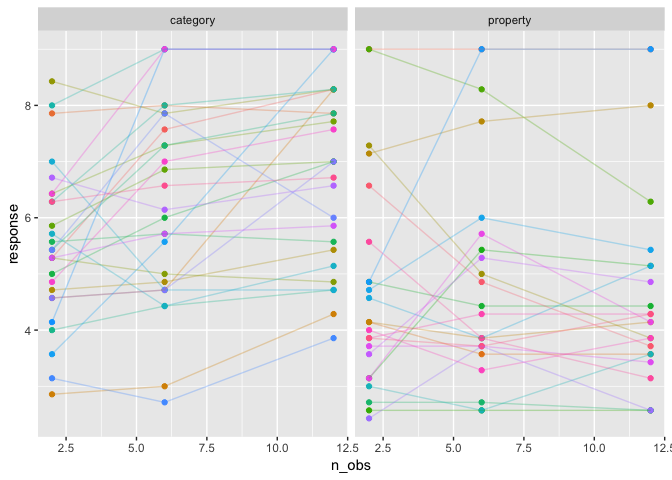
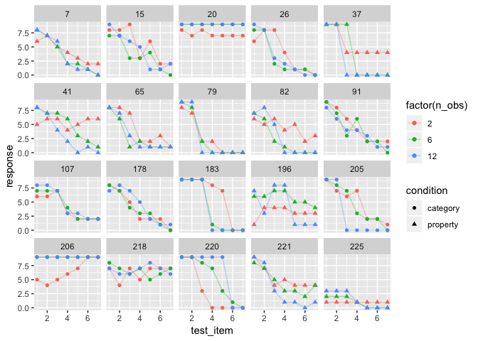
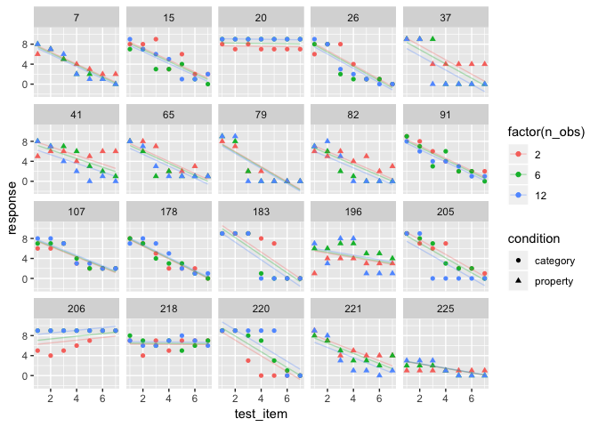

<h1 class="title toc-ignore display-3">
Mixed models in R
</h1>
================
Danielle Navarro
5 December 2018

<!--

  html_document:
    includes:
      in_header: header.html
    theme: flatly
    highlight: textmate
    css: mystyle.css

-->
``` r
library(here)
```

    ## here() starts at /Users/dan/GitHub/chdss2018/day2_dataanalysis

``` r
library(tidyverse)
```

    ## ── Attaching packages ──────────────────────────────────────────────────── tidyverse 1.2.1 ──

    ## ✔ ggplot2 3.1.0     ✔ purrr   0.2.5
    ## ✔ tibble  1.4.2     ✔ dplyr   0.7.8
    ## ✔ tidyr   0.8.1     ✔ stringr 1.3.1
    ## ✔ readr   1.1.1     ✔ forcats 0.3.0

    ## ── Conflicts ─────────────────────────────────────────────────────── tidyverse_conflicts() ──
    ## ✖ dplyr::filter() masks stats::filter()
    ## ✖ dplyr::lag()    masks stats::lag()

``` r
library(lme4)
```

    ## Loading required package: Matrix

    ## 
    ## Attaching package: 'Matrix'

    ## The following object is masked from 'package:tidyr':
    ## 
    ##     expand

``` r
frames <- read_csv(here("analysis","data","frames_ex2.csv"))
```

    ## Parsed with column specification:
    ## cols(
    ##   id = col_integer(),
    ##   gender = col_character(),
    ##   age = col_integer(),
    ##   condition = col_character(),
    ##   sample_size = col_character(),
    ##   n_obs = col_integer(),
    ##   test_item = col_integer(),
    ##   response = col_integer()
    ## )

Example 1: A simple mixed model
-------------------------------

To get started with mixed models, we will look at a version of the `frames` data that is a little more complex than the `tinyframes` data from the last section, but not quite the full thing yet. Specifically, what we'll do is take the (within-subject) average responses across every `test_item`, but we *won't* average across the different values of `n_obs`. That gives us a `modestframes` data set:

``` r
modestframes <- frames %>% 
  group_by(id, age, condition, n_obs) %>%
  summarise(response = mean(response)) %>%
  ungroup()

glimpse(modestframes)
```

    ## Observations: 675
    ## Variables: 5
    ## $ id        <int> 1, 1, 1, 2, 2, 2, 3, 3, 3, 4, 4, 4, 5, 5, 5, 6, 6, 6...
    ## $ age       <int> 36, 36, 36, 46, 46, 46, 33, 33, 33, 71, 71, 71, 23, ...
    ## $ condition <chr> "category", "category", "category", "category", "cat...
    ## $ n_obs     <int> 2, 6, 12, 2, 6, 12, 2, 6, 12, 2, 6, 12, 2, 6, 12, 2,...
    ## $ response  <dbl> 5.857143, 5.285714, 4.857143, 5.285714, 7.571429, 8....

Sequence of models:

``` r
modest1 <- lmer(formula = response ~ 1 + (1|id), data = modestframes)
modest2 <- lmer(formula = response ~ condition + (1|id), data = modestframes)
modest3 <- lmer(formula = response ~ condition + (1 + n_obs|id), data = modestframes)
modest4 <- lmer(formula = response ~ condition + age + (1 + n_obs|id), data = modestframes)
```

Okay let's compare these models in sequence:

``` r
anova(modest1, modest2, modest3, modest4)
```

    ## refitting model(s) with ML (instead of REML)

    ## Data: modestframes
    ## Models:
    ## modest1: response ~ 1 + (1 | id)
    ## modest2: response ~ condition + (1 | id)
    ## modest3: response ~ condition + (1 + n_obs | id)
    ## modest4: response ~ condition + age + (1 + n_obs | id)
    ##         Df    AIC    BIC  logLik deviance   Chisq Chi Df Pr(>Chisq)    
    ## modest1  3 2354.9 2368.5 -1174.5   2348.9                              
    ## modest2  4 2331.5 2349.6 -1161.8   2323.5 25.4013      1  4.656e-07 ***
    ## modest3  6 2268.4 2295.4 -1128.2   2256.4 67.1647      2  2.602e-15 ***
    ## modest4  7 2269.7 2301.3 -1127.9   2255.7  0.6391      1     0.4241    
    ## ---
    ## Signif. codes:  0 '***' 0.001 '**' 0.01 '*' 0.05 '.' 0.1 ' ' 1

So `modest3` looks good:

``` r
summary(modest3)
```

    ## Linear mixed model fit by REML ['lmerMod']
    ## Formula: response ~ condition + (1 + n_obs | id)
    ##    Data: modestframes
    ## 
    ## REML criterion at convergence: 2260.8
    ## 
    ## Scaled residuals: 
    ##     Min      1Q  Median      3Q     Max 
    ## -2.8955 -0.3684 -0.0302  0.3585  3.3912 
    ## 
    ## Random effects:
    ##  Groups   Name        Variance Std.Dev. Corr 
    ##  id       (Intercept) 1.72433  1.3131        
    ##           n_obs       0.01672  0.1293   -0.20
    ##  Residual             0.55277  0.7435        
    ## Number of obs: 675, groups:  id, 225
    ## 
    ## Fixed effects:
    ##                   Estimate Std. Error t value
    ## (Intercept)         5.2273     0.1317   39.70
    ## conditionproperty  -0.6694     0.1875   -3.57
    ## 
    ## Correlation of Fixed Effects:
    ##             (Intr)
    ## cndtnprprty -0.702

Add a column to the data with the fitted values:

``` r
modestframes$modelfit <- predict(modest3)
```

Plot fitted values against data as a check:

``` r
modestframes %>% 
  ggplot(aes(x = modelfit, y = response)) + 
  geom_point() + 
  facet_grid(condition ~ n_obs) + 
  geom_abline(intercept = 0, slope = 1)
```


Let's explore this a bit more substantively:

``` r
whichids <- sample(unique(modestframes$id), 50) 
modestframes %>%
  filter(id %in% whichids) %>%
  ggplot(aes(x = n_obs, y = response, colour = factor(id))) +
  geom_point(show.legend = FALSE) + 
  geom_line(show.legend = FALSE, alpha = .3) + 
  facet_wrap(~ condition)
```



Example 2: Mixed models with more complex designs
-------------------------------------------------

``` r
whichids <- sample(unique(frames$id), 20) 
frames %>%
  filter(id %in% whichids) %>%
  ggplot(aes(x = test_item, y = response, shape = condition, colour = factor(n_obs))) +
  geom_point() + 
  geom_line(alpha = .3) + 
  facet_wrap(~ id)
```



``` r
linframes1 <- lmer(formula = response ~ condition + (1 + n_obs|id), data = frames)
linframes2 <- lmer(formula = response ~ condition + (1 + test_item + n_obs|id), data = frames)
linframes3 <- lmer(formula = response ~ condition + test_item + (1 + test_item + n_obs|id), data = frames)
```

``` r
anova(linframes1, linframes2, linframes3)
```

    ## refitting model(s) with ML (instead of REML)

    ## Data: frames
    ## Models:
    ## linframes1: response ~ condition + (1 + n_obs | id)
    ## linframes2: response ~ condition + (1 + test_item + n_obs | id)
    ## linframes3: response ~ condition + test_item + (1 + test_item + n_obs | id)
    ##            Df   AIC   BIC   logLik deviance   Chisq Chi Df Pr(>Chisq)    
    ## linframes1  6 23126 23164 -11556.8    23114                              
    ## linframes2  9 19888 19946  -9934.7    19870 3244.07      3  < 2.2e-16 ***
    ## linframes3 10 19732 19796  -9855.8    19712  157.92      1  < 2.2e-16 ***
    ## ---
    ## Signif. codes:  0 '***' 0.001 '**' 0.01 '*' 0.05 '.' 0.1 ' ' 1

``` r
summary(linframes3)
```

    ## Linear mixed model fit by REML ['lmerMod']
    ## Formula: response ~ condition + test_item + (1 + test_item + n_obs | id)
    ##    Data: frames
    ## 
    ## REML criterion at convergence: 19720.7
    ## 
    ## Scaled residuals: 
    ##     Min      1Q  Median      3Q     Max 
    ## -5.1775 -0.5141  0.0274  0.5604  3.3037 
    ## 
    ## Random effects:
    ##  Groups   Name        Variance Std.Dev. Corr       
    ##  id       (Intercept) 7.39777  2.7199              
    ##           test_item   0.48680  0.6977   -0.88      
    ##           n_obs       0.01973  0.1404   -0.52  0.37
    ##  Residual             2.80264  1.6741              
    ## Number of obs: 4725, groups:  id, 225
    ## 
    ## Fixed effects:
    ##                   Estimate Std. Error t value
    ## (Intercept)        7.97038    0.18493  43.100
    ## conditionproperty -0.61921    0.16837  -3.678
    ## test_item         -0.69197    0.04583 -15.097
    ## 
    ## Correlation of Fixed Effects:
    ##             (Intr) cndtnp
    ## cndtnprprty -0.449       
    ## test_item   -0.769  0.000

``` r
linframes <- frames
linframes$modelfit <- predict(linframes3)
linframes$residuals <- residuals(linframes3)
```

``` r
linframes %>%
  filter(id %in% whichids) %>%
  ggplot(aes(x = test_item, y = response, shape = condition, colour = factor(n_obs))) +
  geom_point() + 
  geom_line(aes(y = modelfit), alpha = .3) + 
  facet_wrap(~ id)
```



-   crude notes: REML fits the fixed effects first, then estimates the random effects; whereas ML does them jointly. General advice is that you have to test fixed effects using the ML fits; to test random effects you can do it either way, but REML is generally preferred (for reasons).

Generalised linear mixed models
-------------------------------

``` r
glmerframes <- frames %>% mutate(generalisation = (response+.1)/9.2)
```

``` r
logitmod <- glmer(
  formula = generalisation ~ condition + test_item + n_obs + (1 + test_item + n_obs|id), 
  family = gaussian(link = "logit"), 
  data = glmerframes)
```

    ## Warning in checkConv(attr(opt, "derivs"), opt$par, ctrl =
    ## control$checkConv, : Model failed to converge with max|grad| = 1.71494 (tol
    ## = 0.001, component 1)

``` r
summary(logitmod)
```

    ## Generalized linear mixed model fit by maximum likelihood (Laplace
    ##   Approximation) [glmerMod]
    ##  Family: gaussian  ( logit )
    ## Formula: 
    ## generalisation ~ condition + test_item + n_obs + (1 + test_item +  
    ##     n_obs | id)
    ##    Data: glmerframes
    ## 
    ##      AIC      BIC   logLik deviance df.resid 
    ##  -2741.5  -2670.4   1381.7  -2763.5     4714 
    ## 
    ## Scaled residuals: 
    ##     Min      1Q  Median      3Q     Max 
    ## -5.2697 -0.4241  0.0384  0.4929  3.4459 
    ## 
    ## Random effects:
    ##  Groups   Name        Variance Std.Dev. Corr       
    ##  id       (Intercept) 2.216628 1.48883             
    ##           test_item   0.145355 0.38125  -0.86      
    ##           n_obs       0.008568 0.09256  -0.56  0.25
    ##  Residual             0.033600 0.18330             
    ## Number of obs: 4725, groups:  id, 225
    ## 
    ## Fixed effects:
    ##                   Estimate Std. Error t value Pr(>|z|)    
    ## (Intercept)        4.01522    0.30558  13.140   <2e-16 ***
    ## conditionproperty -0.48466    0.18185  -2.665   0.0077 ** 
    ## test_item         -0.99181    0.08175 -12.133   <2e-16 ***
    ## n_obs             -0.01351    0.01551  -0.871   0.3837    
    ## ---
    ## Signif. codes:  0 '***' 0.001 '**' 0.01 '*' 0.05 '.' 0.1 ' ' 1
    ## 
    ## Correlation of Fixed Effects:
    ##             (Intr) cndtnp tst_tm
    ## cndtnprprty -0.346              
    ## test_item   -0.848  0.018       
    ## n_obs       -0.556  0.081  0.332
    ## convergence code: 0
    ## Model failed to converge with max|grad| = 1.71494 (tol = 0.001, component 1)

``` r
glmerframes$modelfit <- predict(logitmod, type="response")
glmerframes$residuals <- residuals(logitmod, type="response")

glmerframes %>%
  filter(id %in% whichids) %>%
  ggplot(aes(x = test_item, y = generalisation, shape = condition, colour = factor(n_obs))) +
  geom_point() + 
  geom_line(aes(y = modelfit), alpha = .3) + 
  facet_wrap(~ id)
```


Where next?
-----------

Bayesian approaches

-   The `brms` package
-   The `BayesFactor` package
-   More generally, JAGS and Stan

Other kinds of models

-   Decision trees and random forests
-   Structural equations models
